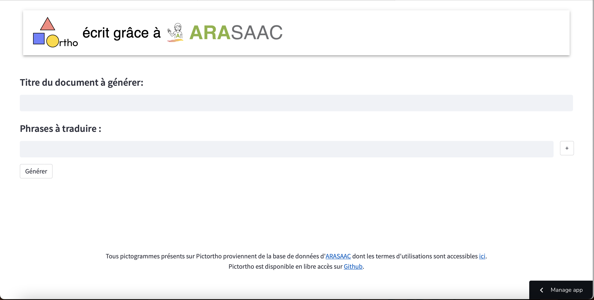
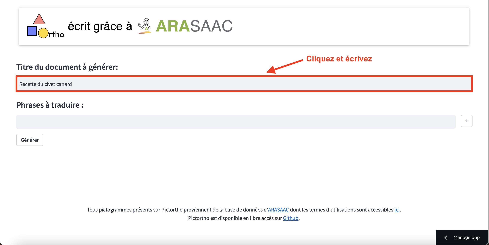
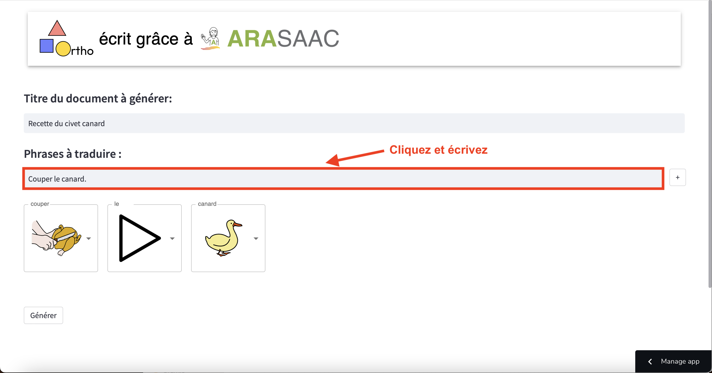
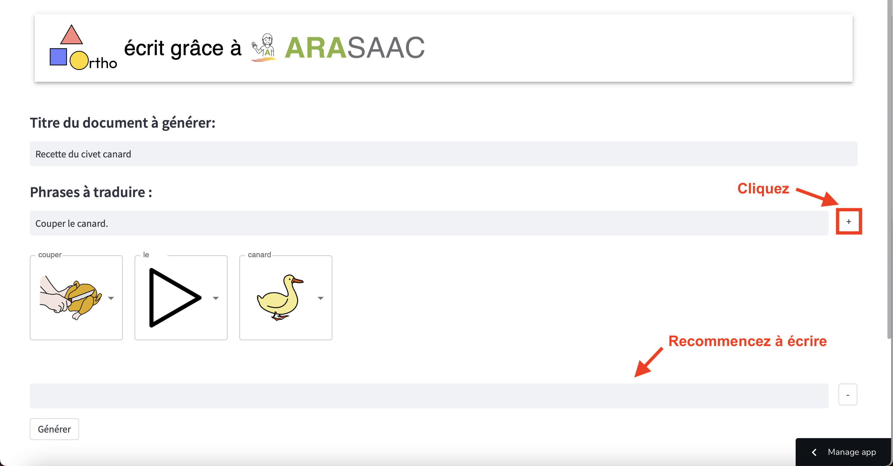
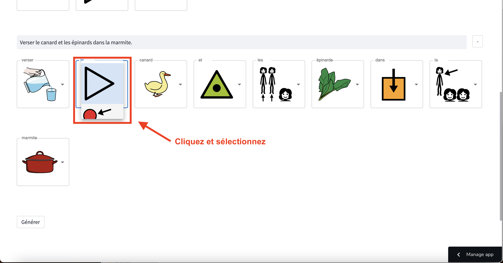
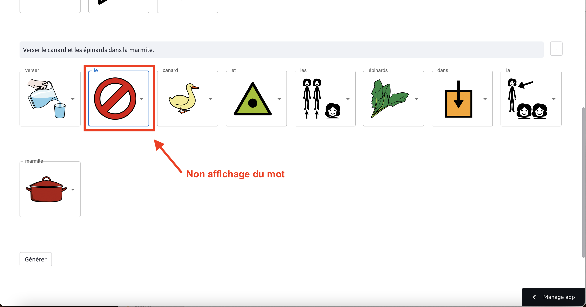
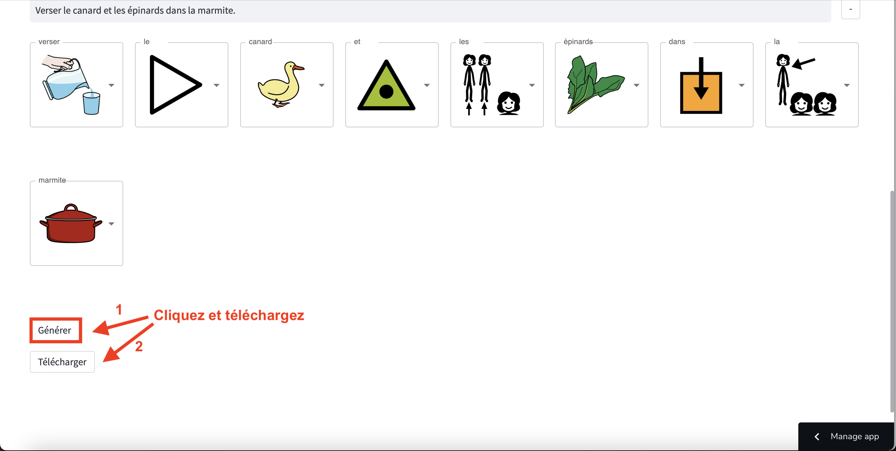

#  Pictortho

## Sommaire

1. [Manuel d'utilisation](#manuel-dutilisation)
2. [Développeur](#développeur)

## Manuel d'utilisation

1. Rendez vous sur le [site](https://pictortho.streamlit.app) de Pictortho pour accéder à la page principale [1].

<p align="center">[1] Page principale de Pictortho</p>

2. Remplissez le champ **Titre du document à générer** [2] pour ajouter un titre au document Word à créer.

<p align="center">[2] Ajout d'un titre au document Word à créer</p>

3. Vous pouvez commencer à écrire une première phrase à traduire dans la section **Phrases à traduire** [3]. La traduction se fait mot-à-mot et une liste de pictogrammes est proposée pour chaque mot.

<p align="center">[3] Traduction d'une phrase</p>

4. Ajoutez autant de phrases que nécessaire avec le bouton + [4].

<p align="center">[4] Ajout d'une phrase</p>

5. Sélectionnez un pictogramme pour chaque mot reconnu par la base de données d'ARASAAC [5].

<p align="center">[5] Menu déroulant pour la sélection</p>

6. Si vous ne voulez pas ajouter le mot reconnu dans la traduction, sélectionnez le non-pictogramme  [6].

<p align="center">[6] Retirer un mot de la traduction final en pictogramme</p>

7. Générez le document Word [7] en cliquant sur le bouton **Générer** [7], un bouton **Télécharger** apparaît qui vous permet de récuperer le document Word.

<p align="center">[7] Récupérer le document Word de la traduction</p>

## Développeur

### Prérequis

Vous avez besoin, au choix :
1. [Docker](https://docs.docker.com/get-docker/)
2. ou [Python>=3.6](https://www.python.org/downloads/)

Ouvrez un terminal.

Clonez le projet : ````git clone https://github.com/victorC97/pictortho````

Placez vous sur la racine du projet : ````cd path_to_pictortho_folder/pictortho````

#### Docker

Vérifiez que **docker daemon** tourne bien sur votre machine (lancez la version Desktop de Docker par exemple).

Lancez la commande start : ````make start````

Pictortho sera accessible sur ````localhost:8501````.

Stoppez le serveur Pictortho avec la commande : ````make stop````

#### Python

Installez les packages nécessaire : ````pip install -r requirements.txt````

Lancez Pictortho : ````streamlit run app.py````

Pictortho sera accessible sur ````localhost:8501````.

Stoppez le serveur Pictortho en utilisant ````Ctrl+C```` sur votre terminal.